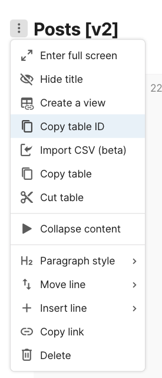

# opencoda 📋->🌐

a resource to easily access data from a [Coda]() table in a JSON format via API for publicly available documents without needing to set up an API key.

## Use Guide

This service is being hosted on Cloudflare Workers, available at https://opencoda.spencerc99.workers.dev/

To use, simply append the doc ID followed by the grid (table) ID. "https://opencoda.spencerc99.workers.dev/<DOC_ID>/<GRID_ID>"

Make sure that the doc is publicly accessible for viewing purposes. Note that if you only want programmatic access to a specific table in a doc and don't want to make the entire doc public, you can always cross-doc the target table into a new doc that you expose for this purpose.


_how to get the table ID from a table in Coda_

### Advanced Use

By default, data will be returned from the Coda API using the following parameters:

```
{
    useColumnNames: true,
    valueFormat: "simpleWithArrays",
    sortBy: "natural",
}
```

This is generally the best for simple data (text, images, numbers, lists of these things). If you would like to retain rich object information or rich text information (formatting for example), then you can override any of these parameters by appending them to the URL as query parameters.
